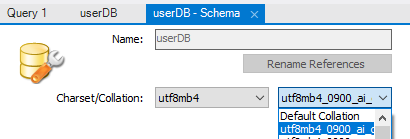
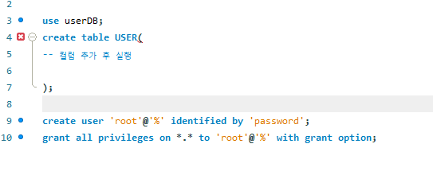
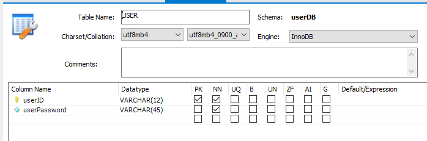
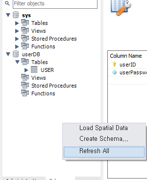
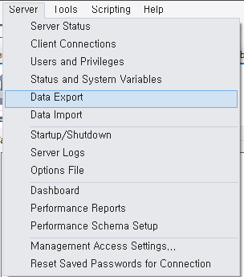
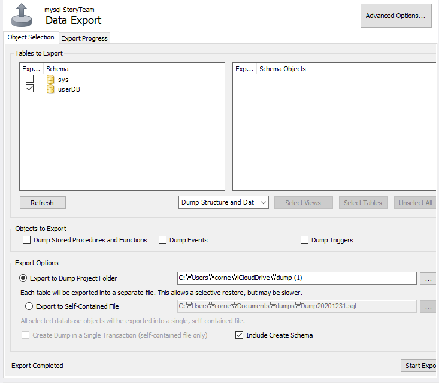
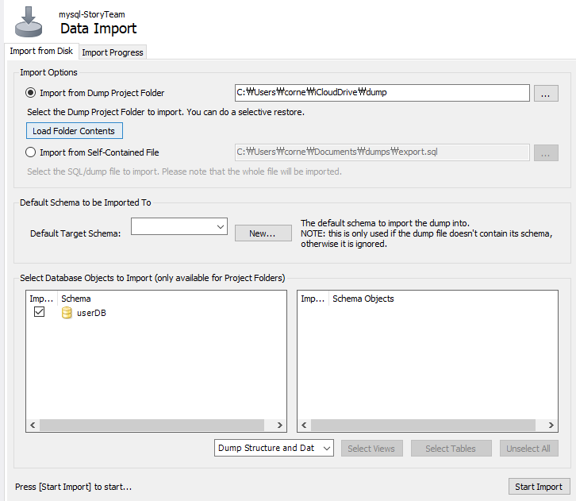

# 🌐MySQL Workbench 사용하기

## workbench에서 DB, table 생성 시 

**이미 생성을 했다면**

오른쪽 수리 아이콘 클릭

**위와 같이 charset/collation 설정을 해준다.**

**SQL 문에서 9번,10번줄 실행 (Ctrl + Enter)**

root 권한을 허용하는 것임

**마찬가지로 table 처음 생성하거나 수정에서 charset/collation을 위와 같이 설정해준다. ** 

**왼쪽 바에서 빈 공간에서 우클릭 후 새로고침을 진행한다.**

**새로고침 진행 후 db와 table이 정상적으로 잘 보인다면**

server -> data export  (내보내기) 

data import (불러오기)

**export to Dump Project Folde 를 체크** 한 뒤 본인의 뜻대로 경로를 지정하고 **include create scheme**를 체크한 뒤

내보내기 실행하면 끝.

---

#### 불러오는 법

프로젝트 폴더를 받아 Load Folder Contents를 눌러 새로고침 후 

아래에 뜨는 불러올 스키마(DB)를 체크하여 import