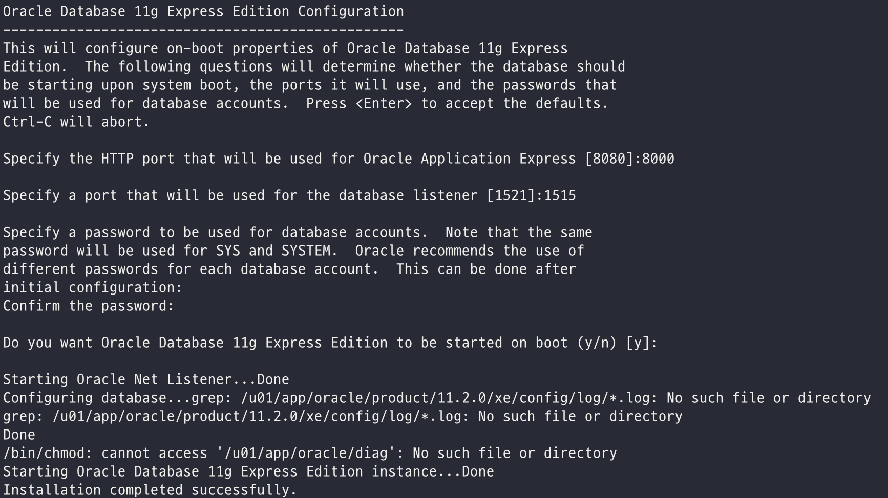

자세한 포스팅은 아래 사이트 참고

### [CentOS7-오라클 설치 완벽가이드 ](https://iu-corner.tistory.com/entry/CentOS-7-오라클-클라우드를-이용하여-oracle-11g-xe-release-설치하기-완벽-가이드)


---


# 1. CentOS 8 오라클 XE-11g 설치 완벽 가이드

### [오라클 다운로드 xe-11g-release Linux.x86_64](https://www.oracle.com/database/technologies/xe-prior-releases.html)


## 2. 의존 라이브러리 설치 

```shell
yum -y install compat-libstdc++-33.x86_64 binutils elfutils-libelf elfutils-libelf-devel
yum -y install glibc glibc-common glibc-devel glibc-headers gcc gcc-c++ libaio-devel
yum -y install libaio libgcc libstdc++ libstdc++ make sysstat unixODBC unixODBC-devel
yum -y install unzip
yum -y install compat-libstdc++-33.x86_64 binutils elfutils-libelf elfutils-libelf-devel
```


`yum install binutils compat-libcap1 compat-libstdc++-33 gcc gcc-c++ glibc glibc-devel ksh libgcc libstdc++ libstdc++-devel libaio libaio-devel make sysstat`

```shell
yum install binutils compat-libcap1 compat-libstdc++-33 gcc gcc-c++ glibc glibc-devel ksh libgcc libstdc++ libstdc++-devel libaio libaio-devel make sysstat
```


## 파라미터 및 유저 리소스 설정

#### 1) 커널 파라미터 값을 설정합니다.

```shell
[root@localhost ~]# vi /etc/sysctl.conf
```


다음과 같은 값을 저장

```shell
# Controls the maximum shared segment size, in bytes
kernel.shmmax = 68719476736

# Controls the maximum number of shared memory segments, in pages
kernel.shmall = 10523004
kernel.shmmni = 4096
kernel.sem = 250 32000 100 128

fs.aio-max-nr = 1048576
fs.file-max = 6815744

net.ipv4.ip_local_port_range = 9000 65500

net.core.rmem_default = 262144
net.core.rmem_max = 4194304
net.core.wmem_default = 262144
net.core.wmem_max = 1048586
```


값 적용

```shell
[root@localhost ~]# /sbin/sysctl -p
```


#### 2) 유저의 자원 사용 제한값을 설정

```shell
[root@localhost ~]# vi /etc/security/limits.conf
```


해당 파일 맨 하단에 값을 추가한다.

```shell
oracle soft nproc 2048
oracle hard nproc 65536
oracle soft nofile 1024
oracle hard nofile 65536
```


#### 3) SELINUX 설정을 해제

```shell
# This file controls the state of SELinux on the system. 
# SELINUX= can take one of these three values: 
#     enforcing - SELinux security policy is enforced. 
#     permissive - SELinux prints warnings instead of enforcing. 
#     disabled - No SELinux policy is loaded. 
SELINUX=disabled
```


## 3. 유저 생성, 환경변수 설정, 권한 설정

오라클을 사용할 유저를 생성하고 패스워드 설정

```shell
[root@localhost ~]# groupadd dba
[root@localhost ~]# useradd -g dba oracle
[root@localhost ~]# passwd oracle
```


오라클을 설치할 디렉터리를 생성하고 위에서 만든 오라클 계정에 권한을 부여한다.

```shell
[root@localhost ~]# mkdir -p /app/oracle
[root@localhost ~]# chown -R oracle:dba /app
[root@localhost ~]# chmod -R 775 /app
```


oracle 계정으로 접속하여 아래의 환경 변수를 저장

```shell
[root@localhost ~]# su - oracle
[oracle@localhost ~]$ vi .bash_profile
```

```shell
export ORACLE_BASE=/app/oracle
export ORACLE_HOME=$ORACLE_BASE/product/11.2.0/dbhome_1
export ORACLE_SID=orcl
export NLS_LANG=AMERICAN_AMERICA.AL32UTF8
export LD_LIBRARY_PATH=$ORACLE_HOME/lib:/lib:/usr/lib:/usr/local/lib
export PATH=$PATH:$ORACLE_HOME/bin

# alias
alias ss='sqlplus / as sysdba'
```


## 4. 오라클 (Oracle) 설치하기

##### Windows 유저는 FileZilla나 winSCP 프로그램 추천

##### MacOS는 FileZilla 추천

프로그램 설치 및 설정 사용법은 [ 여 기 ]

```shell
[root@localhost ~]$ unzip oracle-xe-11g.zip # 오라클 알집파일
```

```shell
[root@localhost Disk1]$ rpm -Uvh oracle-xee-11g.rpm # 오라클 설치파일
```

설치 완료 후 configure 설정 

```shell
[root@localhost Disk1]$ /etc/ini.d/oracle-xe configure
```




기본 포트는 8080인데 톰캣과 충돌나지 않게하려면 8000번으로 지정 Default는 엔터

오라클 기본 포트는 1521인데 기본값이면 엔터, 따로 지정할 포트면 입력

**oracle에 접속할 비밀번호 입력 (잊지말 것)**


설정이 완료 되었으면 

```shell
[root@event-web Disk1]$ cd /u01/app/oracle/product/11.2.0/xe/network/admin/
```

```shell
[root@event-web admin]$ vi listener.ora
```


아래와 같이 리스너를 수정한다. 오타, 띄어쓰기 주의하여야 한다.

```SHELL
# listener.ora Network Configuration File:

SID_LIST_LISTENER =
  (SID_LIST =
    (SID_DESC =
      (SID_NAME = PLSExtProc)
      (ORACLE_HOME = /u01/app/oracle/product/11.2.0/xe)
      (PROGRAM = extproc) )

    (SID_DESC =
      (GLOBAL_DBNAME = XE)
      (ORACLE_HOME = /u01/app/oracle/product/11.2.0/xe)
      (SID_NAME = XE)
      (SERVICE_NAME = XE)
    )
  )

LISTENER =
  (DESCRIPTION_LIST =
    (DESCRIPTION =
      (ADDRESS = (PROTOCOL = IPC)(KEY = EXTPROC_FOR_XE))
      (ADDRESS = (PROTOCOL = TCP)(HOST = 127.0.0.1)(PORT = 1515))
    )
  )

DEFAULT_SERVICE_LISTENER = (XE)
~
```

이후 esc -> :wq 로 나와서

tnsnames.ora 수정

```shell
[root@event-web admin]$ vi tnsnames.ora
```


```shell
# tnsnames.ora Network Configuration File:

XE =
  (DESCRIPTION =
    (ADDRESS = (PROTOCOL = TCP)(HOST = 127.0.0.1)(PORT = 1515))
    (CONNECT_DATA =
      (SERVER = DEDICATED)
      (SERVICE_NAME = XE)
    )
  )

EXTPROC_CONNECTION_DATA =
  (DESCRIPTION =
    (ADDRESS_LIST =
      (ADDRESS = (PROTOCOL = IPC)(KEY = EXTPROC_FOR_XE))
    )
    (CONNECT_DATA =
      (SID = PLSExtProc)
      (PRESENTATION = RO)
    )
  )

```


---


## CentOS 8, 방화벽 열기

sudo iptables -I INPUT 5 -i ens3 -p tcp --dport 80 -m state --state NEW,ESTABLISHED -j ACCEPT

sudo iptables -I INPUT 5 -i ens3 -p tcp --dport 8080 -m state --state NEW,ESTABLISHED -j ACCEPT

sudo iptables -I INPUT 5 -i ens3 -p tcp --dport 443 -m state --state NEW,ESTABLISHED -j ACCEPT

sudo iptables -I INPUT 5 -i ens3 -p tcp --dport 8080-m state --state NEW,ESTABLISHED -j ACCEPT

sudo iptables -I INPUT 5 -i ens3 -p tcp --dport 1515 -m state --state NEW,ESTABLISHED -j ACCEPT

sudo iptables -I INPUT 5 -i ens3 -p tcp --dport 1521 -m state --state NEW,ESTABLISHED -j ACCEPT


\* nginx systemctl restart 후 500 error 발생시 아래 실행

$> sudo semanage permissive -a httpd_t